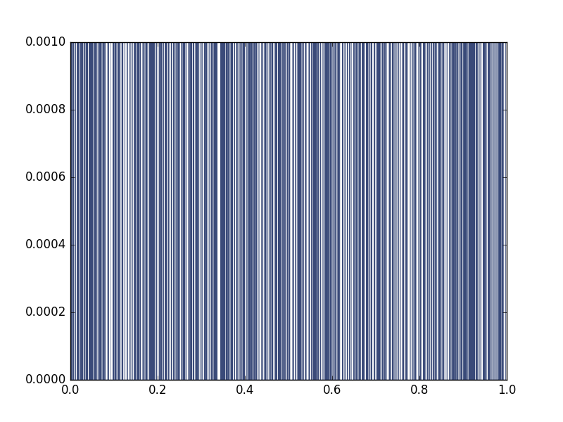
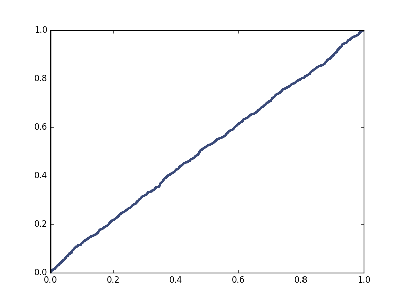

[Think Stats Chapter 4 Exercise 2](http://greenteapress.com/thinkstats2/html/thinkstats2005.html#toc41) (a random distribution)

###Python Code Chunks

**Exercise 4.2** The numbers generated by random.random are supposed to be uniform between 0 and 1; that is, every value in the range should have the same probability. Generate 1000 numbers from random.random and plot their PMF and CDF. Is the distribution uniform?

####Generate random numbers

```python
import random
random_list = []
cnt = 0
while cnt < 1000:
  random_list.append(random.random())
  cnt = cnt + 1
```

####Plot PMF

```python
import thinkstats2
import thinkplot
pmf = thinkstats2.Pmf(random_list)
thinkplot.Pmf(pmf, linewidth=0.2)
thinkplot.Show()
```

It looks to be evenly distributed and looks random



####Plot CDF

```python
cdf = thinkstats2.Cdf(random_list)
thinkplot.Cdf(cdf)
thinkplot.Show()
```

Cumulative density plot also shows an even distribution



