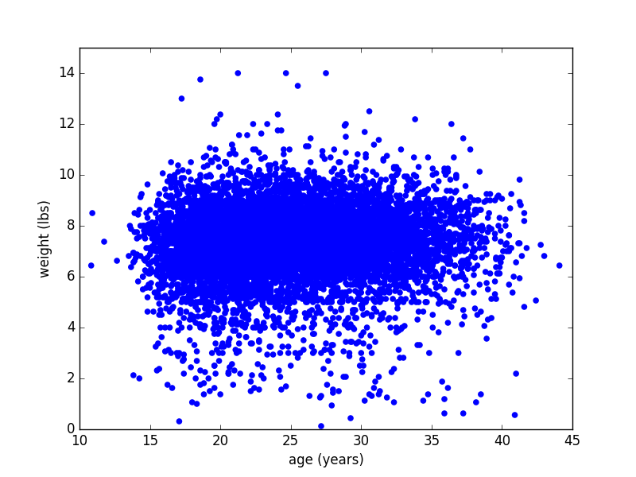
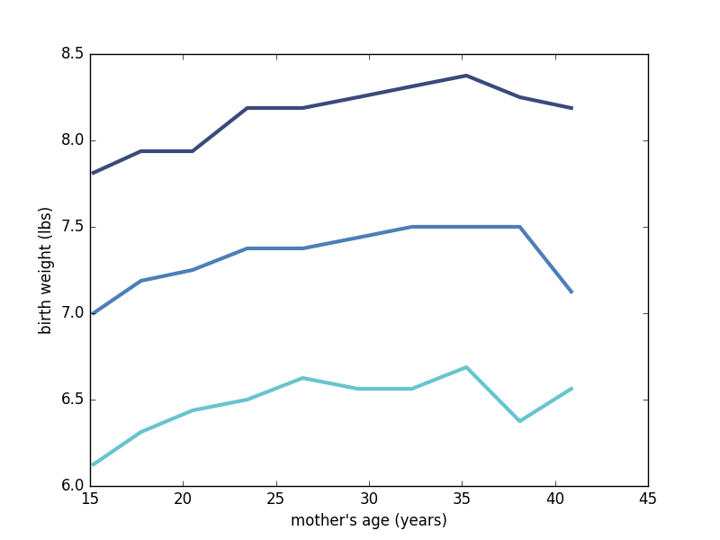

[Think Stats Chapter 7 Exercise 1](http://greenteapress.com/thinkstats2/html/thinkstats2008.html#toc70) (weight vs. age)

###Python Code Chunks

**Exercise 7.1** 
Using data from the NSFG, make a scatter plot of birth weight versus mother’s age. 
Plot percentiles of birth weight versus mother’s age. 
Compute Pearson’s and Spearman’s correlations. 
How would you characterize the relationship between these variables?

```python
import sys
import numpy as np
import math

import nsfg
import first
import thinkplot
import thinkstats2

# dataframe
preg = nsfg.ReadFemPreg()
live = preg[preg.outcome == 1] # live births only

# live births only - scatter plot - age at preg outcome vs baby total weight (lbs)
thinkplot.Scatter(live['agepreg'], live['totalwgt_lb'], alpha=1.0)
thinkplot.Config(xlabel='age (years)',
                 ylabel='weight (lbs)',
                 xlim=[10, 45],
                 ylim=[0, 15],
                 legend=False)

thinkplot.Show()
```




```python
# plot percentiles of birth weight vs mother's age
bins = np.arange(10, 48, 3)
indices = np.digitize(live.agepreg, bins)
groups = live.groupby(indices)

ages = [group.agepreg.mean() for i, group in groups][1:-1]
cdfs = [thinkstats2.Cdf(group.totalwgt_lb) for i, group in groups][1:-1]

thinkplot.PrePlot(3)

for percent in [75, 50, 25]:
  weights = [cdf.Percentile(percent) for cdf in cdfs]
  label = '%dth' % percent
  thinkplot.Plot(ages, weights, label=label)

thinkplot.Show(xlabel="mother's age (years)",
               ylabel="birth weight (lbs)")
```



```python
thinkstats2.RandomSeed(17)

live = preg[preg.outcome == 1] # live births only
firsts = live[live.birthord == 1] # first borns
others = live[live.birthord != 1] # non-first borns

live, firsts, others = first.MakeFrames()
live = live.dropna(subset=['agepreg', 'totalwgt_lb'])

ages = live.agepreg
weights = live.totalwgt_lb
print('thinkstats2 PearsonCorr', thinkstats2.Corr(ages, weights))
print('thinkstats2 SpearmanCorr', thinkstats2.SpearmanCorr(ages, weights))

# ('thinkstats2 PearsonCorr', 0.068833970354109056)
# ('thinkstats2 SpearmanCorr', 0.094610041096582262)

```

Clearly, there is no strong linear correlation between birth weight and mothers' age.

| Type   | Corr Value  |
|---------|-------------|
| Pearson | 0.068833970354109056 |
| Spearman | 0.094610041096582262 |


