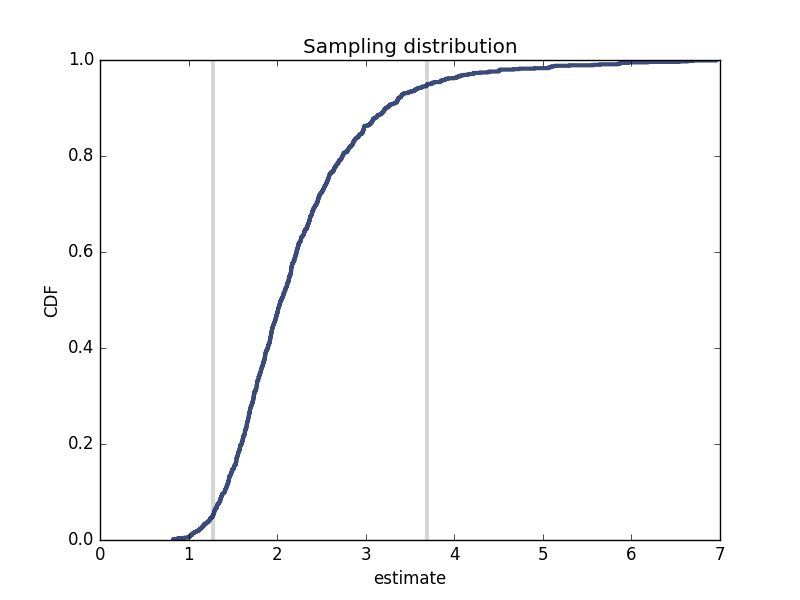

[Think Stats Chapter 8 Exercise 2](http://greenteapress.com/thinkstats2/html/thinkstats2009.html#toc77) (scoring)

###Python Code Chunks

**Exercise 8.2** Suppose you draw a sample with size n = 10 from an exponential distribution with λ = 2 Simulate this experiment 1000 times and plot the sampling distribution of the estimate L. Compute the standard error of the estimate and the 90% confidence interval. Repeat the experiment with a few different values of n and make a plot of standard error versus n.


```python
# lam=2, n=10, m=1000

import numpy as np
import math

import thinkplot
import thinkstats2

# root mean squared error function
def RMSE(estimates, actual):
  e2 = [(estimate-actual)**2 for estimate in estimates]
  mse = np.mean(e2)
  return math.sqrt(mse)

# generate sampling distribution
estimates = []
for j in range(1000):
    xs = np.random.exponential(1.0/2, 10)
    lamhat = 1.0 / np.mean(xs)
    estimates.append(lamhat)

# calc standard error (RMSE)
stderr = RMSE(estimates, 2)
print('standard error', stderr)
# ('standard error', 0.8688531915558672)

# cumulative density function
cdf = thinkstats2.Cdf(estimates)
ci = cdf.Percentile(5), cdf.Percentile(95)
print('confidence interval', ci)
# ('confidence interval', (1.2704112456455572, 3.6967743165781104))

thinkplot.Plot([ci[0], ci[0]], [0, 1], color='0.8', linewidth=3) # vertical line 1
thinkplot.Plot([ci[1], ci[1]], [0, 1], color='0.8', linewidth=3) # vertical line 2

# plot the CDF
thinkplot.Cdf(cdf)
thinkplot.Show(xlabel='estimate',
               ylabel='CDF',
               title='Sampling distribution')
```



